Install required packages
```{r message=FALSE, warning=FALSE}
if (!requireNamespace("BiocManager", quietly = TRUE))
    install.packages("BiocManager")
# BiocManager::install("TCGAbiolinks")

library(knitr)
library(ComplexHeatmap)
library(circlize)
library(limma)
library(Biobase)
library(tidyr)
library(dplyr)
library("edgeR")
library(kableExtra)

```
# Introduction:
The dataset I have chosen to work for the assignment is titled Comprehensive analyses of B cell compartments across the human body reveal novel subsets and a gut resident memory phenotype. It can be found at https://www.ncbi.nlm.nih.gov/geo/query/acc.cgi?acc=GSE154583. This dataset  analyizes  B lineage cells in various tissues of multiple healthy organ donors which reveal tissue-specific differences and lack of correspondence between blood and tissues. New, functionally distinct memory B cell subsets were discovered, including one subset specific to the gut that has unique surface markers and a unique gene expression signature.
 	
## Overall design:	
RNA profiling of memory B cell subsets defined by CD45RB and CD69 expression in spleen. There were 4 biological replicates. I will be analysing the samples to find differences between naive B cell and MBC (memory B cell) across the 4 donors. 

The table below depicts the data set. The sample names legend is as follows:
D = donor
A/B/C/D = the donor name
N = Naive cell type
M = MBC
[1-9] = sample number for that cell type from that donor
Example: D.D.N.1 is the first sample from donor d of naive b cell type.
```{r}
library(knitr)

normalized_count_data <- read.table(file=file.path(getwd(),"data", "ncmatrix.txt"),
                                    header = TRUE,sep = " ",
                                    stringsAsFactors = FALSE,
                                    check.names=FALSE)
kable(normalized_count_data[1:8,1:8], type="html")

```

# Initial heatmap
Create the heatmap matrix, i.e. matrix with data that will be used to create a heatmap of our data. The heatmap below is tscaled so that all the heat is not taken a single gene. Notice that the heatmap is very variable according to both cell type and the donor which it comes from. First, let's try and group our samples according to cell type. 
```{r, message=FALSE, warning=FALSE}
heatmap_matrix <- normalized_count_data[,
                        1:ncol(normalized_count_data)]
rownames(heatmap_matrix) <- rownames(normalized_count_data)
colnames(heatmap_matrix) <- colnames(normalized_count_data[,
                        1:ncol(normalized_count_data)])
library(ComplexHeatmap)
library(circlize)


# row normalise the matrix so that 1 dominant gene doesnt take all the heat.
heatmap_matrix <- t(scale(t(heatmap_matrix)))


# if all vals in heatmap are positive (i.e. min == 0) then use only red and white
if(min(heatmap_matrix) == 0){
    heatmap_col = colorRamp2(c( 0, max(heatmap_matrix)), 
                             c( "white", "red"))
  } else {
    heatmap_col = colorRamp2(c(min(heatmap_matrix), 0, 
          max(heatmap_matrix)), c("blue", "white", "red"))
  }
 # show dend sets the cluster points
current_heatmap <- Heatmap(as.matrix(heatmap_matrix),
                          
      show_row_dend = TRUE,show_column_dend = TRUE, 
      col=heatmap_col,show_column_names = TRUE, 
      show_row_names = FALSE,show_heatmap_legend = TRUE)

```

## Heatmap 
```{r}

current_heatmap
```
 I'll sort the samples according to cell type (naive and MBC) and looked for CD69 signatures. I'm looking for CD69 signatures as that was the gene focused in the research paper linked to my dataset. 
```{r}
naive_samples <- grep(colnames(normalized_count_data),
                          pattern="N")
mbc_samples <- grep(colnames(normalized_count_data),
                          pattern="M")
gene_of_interest <- which(
  rownames(normalized_count_data) == "CD69")
gene_of_interest
```

# Model Design
Let's take a look at the counts for CD69 in naive and MBC samples that we created above. Notice that there is a lot of variability in the data when we compare samples from different donors.

```{r}

naive_samples <- t(normalized_count_data[gene_of_interest, naive_samples])
colnames(naive_samples) <- c("naive_samples")
naive_samples

mbc_samples <- t(normalized_count_data [gene_of_interest, mbc_samples])
colnames(naive_samples) <- c("mbc_samples")
mbc_samples
```

```{r}
t.test(x=t(naive_samples),y=t(mbc_samples))
```

There is not much variation in the T test so I'll use limma to find a regression that explains our data.
But first, let's plot the data to see how samples are different when we compare them across donors and cell type.

```{r}
samples_colors <- rainbow(7)
samples_colors <- unlist(lapply(samples_colors,FUN=function(x){rep(x,4)}))
limma::plotMDS(heatmap_matrix,
               col = samples_colors )

```

As we have observed so far through the plot, the variability in samples is very dependent on which donor it was extracted from. Additionally the b cell type also impacts how our differential will behave. so we have two groups - patients and cell type.
```{r}
samples <- data.frame(
        lapply(colnames(normalized_count_data)[1:27], 
        FUN=function(x){
          unlist(strsplit(x, split = "\\."))[c(2,3)]}))
colnames(samples) <- colnames(normalized_count_data)[1:27]
rownames(samples) <- c("donors","cell_type")
samples <- data.frame(t(samples))
samples[4:10,]
```
#E Simple model Limma
First let's design a simple model to work on. The simple model only performs analysis on cell type and doesn't look at differences in donors. 
```{r}
model_design <- model.matrix(~ samples$cell_type )
kable(model_design[1:5,], type="html")
#whenever cell type is mbc, intercept will be 0
```

I'll make an expression matrix for the model which takes the normalised counts data and fits our data according to the simple model I defined above. 
```{r, message=FALSE, warning=FALSE}
library(limma)
library(Biobase)
expressionMatrix <- as.matrix(normalized_count_data[,1:27])
rownames(expressionMatrix) <- 
  rownames(normalized_count_data)
colnames(expressionMatrix) <- 
  colnames(normalized_count_data)[1:27]
minimalSet <- ExpressionSet(assayData=expressionMatrix)

# Fit our data to the above model
fit <- lmFit(minimalSet, model_design)

# Apply empircal Bayes to compute differential expression for the above described model.
fit2 <- eBayes(fit,trend=TRUE)

```

Adding to my simpler model, I will be using the fit we got for our model design after emprical bayes. To support multiple hypothesis testing, I'll be using the Benjamni - hochberg method to adjust the p values. The table below shows the top hits in our normalised counts, ordered according to P value. We're only using top hits in the model for now, we'll consider the lower hits while doing enrichment analysis.

```{r}
# take our model and adjust it to support multiple hypothesis testing.
topfit <- topTable(fit2, 
                   coef=ncol(model_design),
                   adjust.method = "BH",
                   number = nrow(expressionMatrix))
output_hits <- merge(normalized_count_data[,1:1],
                     topfit,
                     by.y=0,by.x=1,
                     all.y=TRUE)
output_hits <- output_hits[order(output_hits$P.Value),]
library(tidyr)
library(dplyr)
names(output_hits)[names(output_hits) == "x"] <- "hgnc_symbol"
kable(output_hits[1:10,1:7],type="html",row.names = FALSE)

```
-Calculate p-values for each of the genes in your expression set. How many genes were significantly differentially expressed? What thresholds did you use and why?

The number of genes which pass the threshold p-value in our top hits:I'm choosing the standard value 0.05 for the threshold. A lot of genes pass the threshold as well as correction so in some of the differentials ahead, i'll choose a lower threshold.
```{r}
#genes which pass threshold
length(which(output_hits$P.Value < 0.05))
# genes which pass correction
length(which(output_hits$adj.P.Val < 0.05))

```

## Donor model Limma

Now let's correct our model to account for donor variability in our samples. I'll create a new model for this and create a fit similar to what I did in the simple model. the table below shows how the new model is defined and what variables we're considering. I predict that the new model will show us more accurate results, eliminating chance in our analysis. 
```{r}
model_design_d1 <- model.matrix(
  ~samples$donors + samples$cell_type)
kable(model_design_d1[1:5,1:5],type="html")

```
- Multiple hypothesis testing - correct your p-values using a multiple hypothesis correction method. Which method did you use? And Why? How many genes passed correction?

Adding to my new model, I will be using the fit we got for our model design after emprical bayes. To support multiple hypothesis testing, again,  I'll be using the Benjamni - hochberg method to adjust the p values. The table below shows the top hits in our normalised counts, ordered according to P value. We're only using top hits in the model for now, we'll consider the lower hits while doing enrichment analysis.
```{r}

fit_d1 <- lmFit(minimalSet, model_design_d1)
fit2_d1 <- eBayes(fit_d1,trend=TRUE)


topfit_d1 <- topTable(fit2_d1, 
                   coef=ncol(model_design_d1),
                   adjust.method = "BH",
                   number = nrow(expressionMatrix))
output_hits_d1 <- merge(normalized_count_data[,1:1],
                         topfit_d1,by.y=0,by.x=1,all.y=TRUE)
output_hits_d1 <- output_hits_d1[order(output_hits_d1$P.Value),]
library(tidyr)
library(dplyr)
names(output_hits_d1)[names(output_hits_d1) == "x"] <- "hgnc_symbol"
kable(output_hits_d1[1:10,1:7],type="html",row.names = FALSE)


```

The number of genes which pass the threshold p-value in our top hits of the new model. Again the threshold value is chosen to be 0.05 here.

```{r}
# correction test
length(which(output_hits_d1$P.Value < 0.05))
length(which(output_hits_d1$adj.P.Val < 0.05))

```

## Comparing simple and donor models
The graph below compares the P values of different genes in both the models i.e. from when we only accounted for cell variablity vs when we added the donors. This might help us conduct a more accurate analysis and eliminate counts by chance.
```{r}
simple_model_pvalues <- data.frame(gene_id =
  output_hits$hgnc_symbol,
  simple_pvalue=output_hits$P.Value)
pat_model_pvalues <-  data.frame(gene_id =
  output_hits_d1$hgnc_symbol,
  donor_pvalue = output_hits_d1$P.Value)
two_models_pvalues <- merge(simple_model_pvalues,
  pat_model_pvalues,by.x=1,by.y=1)
two_models_pvalues$colour <- "black"
two_models_pvalues$colour[
  two_models_pvalues$simple_pvalue<0.05] <- "orange"
two_models_pvalues$colour[
  two_models_pvalues$donor_pvalue<0.05] <- "blue"
two_models_pvalues$colour[
  two_models_pvalues$simple_pvalue<0.05 &
  two_models_pvalues$donor_pvalue<0.05] <- "red"

plot(two_models_pvalues$simple_pvalue,
     two_models_pvalues$donor_pvalue,
     col = two_models_pvalues$colour,
     xlab = "simple model p-values",
     ylab ="donor model p-values", 
     main="Simple vs donor Limma")

legend(0,1,legend=c("simple","donor", "both", "rest"),
       fill=c("orange","blue", "red", "black"),cex = 0.7)
```

## Simple Vs Donor Model
The graph below compares the  normalized counts for gene CD69 amongst different genes in both the models i.e. from when we only accounted for cell variablity vs when we added the donors. 

```{r}
cd69_gene <- rownames(normalized_count_data)[
  which(rownames(normalized_count_data) == "CD69")]
two_models_pvalues$colour <- "grey"
two_models_pvalues$colour[two_models_pvalues$gene_id==
                            cd69_gene] <- "red"
plot(two_models_pvalues$simple_pvalue,
     two_models_pvalues$donor_pvalue,
     col = two_models_pvalues$colour,
     xlab = "simple model p-values",
     ylab ="Donor model p-values",
      main="Simple vs Donor Limma")
points(two_models_pvalues[which(
  two_models_pvalues$gene_id == cd69_gene),2:3], 
       pch=20, col="red", cex=1.5)
legend(0,1,legend=c("CD69","rest"),
       fill=c("red","grey"),cex = 0.7)

```

I'll now readjust my heatmap to reflect the genes in our donor model which have a p value threshold of 0.01. 
The below heatmap shows the top hits of the model which accounts for variability between donors in the samples. 

```{r}
top_hits <- output_hits_d1$hgnc_symbol[output_hits_d1$P.Value<0.01]
heatmap_matrix_tophits <- t(
  scale(t(heatmap_matrix[
    which(rownames(heatmap_matrix) %in% top_hits),])))
if(min(heatmap_matrix_tophits) == 0){
    heatmap_col = colorRamp2(c( 0, max(heatmap_matrix_tophits)), 
                             c( "white", "red"))
  } else {
    heatmap_col = colorRamp2(c(min(heatmap_matrix_tophits), 0, max(heatmap_matrix_tophits)),c( "blue","white", "red"))
  }
current_heatmap <- Heatmap(as.matrix(heatmap_matrix_tophits),
                           cluster_rows = TRUE,
                           cluster_columns = FALSE,
                               show_row_dend = TRUE,
                               show_column_dend = FALSE, 
                               col=heatmap_col,
                               show_column_names = TRUE, 
                               show_row_names = FALSE,
                               show_heatmap_legend = TRUE,
                         )

current_heatmap
```
# Analysis with edgeR
Up until now I've been using limma for analysis but since the data expression type is bulk RNA seq, it'll be better to try and use edgeR. Let's use our donor model and make a heatmap according to the quasilikelihood method. The DGElist estimates dispersion and we can make a fit for the model like we did with Limma and ebayes. I've taken 13 as the threshold for count per millions following the edgeR protocol. 

## Filter counts
```{r}
library("edgeR")
mc <- read.table(file=file.path(getwd(),"data","counts.txt"),
                                    header = TRUE,sep = " ",
                                    stringsAsFactors = FALSE,
                                    check.names=FALSE)
cpms = cpm(mc[, 1:27])
rownames(cpms) <- mc[,1]
# get rid of low counts
keep = rowSums(cpms >1) >=13  # following the edgeR protocol

counts_filtered = mc[keep,]
filtered_data_matrix <- as.matrix(counts_filtered[,1:27])
#set up the list
dgeList = DGEList(counts=filtered_data_matrix, group=samples$cell_type)

#uncomment the below line to view our dgeList
#dgeList
#Estimate dispersion in our donor model design
dgeList <- estimateDisp(dgeList, model_design_d1)

#fit the model according to Quasi likelihood method
fit <- glmQLFit(dgeList, model_design_d1)
library(kableExtra)
kable(model_design_d1[1:10,1:5], type="html") %>% row_spec(0, angle=45)


```

## Quasi-Likeli Method
Calculate the differential expression for the Quasi-likelihood method. I'm using cell type as the coefficient here from the intercept matrix above. The table below depicts the qlf model. 

```{r}
qlf.naive_vs_mbc <- glmQLFTest(fit, coef='samples$cell_typeN')
kable(topTags(qlf.naive_vs_mbc), type="html",row.names = FALSE)

```
The qlf model has these many genes which pass the threshold P-value and FDR (0.05).

```{r}
qlf_output_hits <- topTags(qlf.naive_vs_mbc,sort.by = "PValue",
                           n = nrow(normalized_count_data))

length(which(qlf_output_hits$table$PValue < 0.05))
length(which(qlf_output_hits$table$FDR < 0.05))

```

## Comparing Limma and edgeR results
The graph below compares our differential results (genes which passed the threshold as well as correction) from limma and edgeR. 
```{r}
qlf_d_model_pvalues <- data.frame(
          hgnc_id = rownames(qlf_output_hits$table),
          qlf_d_pvalue=qlf_output_hits$table$PValue)
limma_d_model_pvalues <-  data.frame(
          hgnc_id = output_hits_d1$hgnc_symbol,
          limma_d_pvalue = output_hits_d1$P.Value)
two_models_pvalues <- merge(qlf_d_model_pvalues,
                            limma_d_model_pvalues,
                            by.x=1,by.y=1)
two_models_pvalues$colour <- "black"
two_models_pvalues$colour[two_models_pvalues$qlf_d_pvalue
                          <0.05] <- "orange"
two_models_pvalues$colour[two_models_pvalues$limma_d_pvalue
                          <0.05] <- "blue"
two_models_pvalues$colour[two_models_pvalues$qlf_d_pvalue
                          <0.05 & two_models_pvalues$limma_d_pvalue]  <- "red"
plot(two_models_pvalues$qlf_d_pvalue,
     two_models_pvalues$limma_patient_pvalue,
     col = two_models_pvalues$colour,
     xlab = "QLF donor model p-values",
     ylab ="Limma donor model p-values",
     main="QLF vs Limma")
legend(0,1,legend=c("QLF","Limma", "both", "rest"),
       fill=c("orange","blue", "red", "black"),cex = 0.7)

```

-Show the amount of differentially expressed genes using an MA Plot or a Volcano plot. Highlight genes of interest.
Similar to the limma method let's look at CD69 variations 
```{r}
cd69_gene <- rownames(normalized_count_data)[
  which(rownames(normalized_count_data) == "CD69")]
two_models_pvalues$colour <- "grey"
two_models_pvalues$colour[two_models_pvalues$hgnc_id
                          ==cd69_gene] <- "red"
plot(two_models_pvalues$qlf_d_pvalue,
     two_models_pvalues$limma_d_pvalue,
     col = two_models_pvalues$colour,
     xlab = "QLF patient model p-values",
     ylab ="Limma Patient model p-values",
     main="QLF vs Limma")
points(two_models_pvalues[
  two_models_pvalues$hgnc_id==cd69_gene,2:3],
       pch=24,  col="red", cex=1.5)
legend(0,1,legend=c("CD69","rest"),
       fill=c("red","grey"),cex = 0.7)
```

Now let's make the heatmap according to our Quasi-likeli differential. This heatmap is divided properly between the two cell types (MBC samples on the left and naive samples on the right). Once again i've chosen the threshold value as 0.05.

```{r, message=FALSE, warning=FALSE}
top_hits <- rownames(qlf_output_hits$table)[output_hits_d1$P.Value <0.05] 
heatmap_matrix_tophits <- t(
  scale(t(heatmap_matrix[which(rownames(heatmap_matrix) 
                               %in% top_hits),]))) 
heatmap_matrix_tophits<- heatmap_matrix_tophits[,
  c(grep(colnames(heatmap_matrix_tophits),pattern = "M"),
    grep(colnames(heatmap_matrix_tophits),pattern = "N"))]
if(min(heatmap_matrix_tophits) == 0){
    heatmap_col = colorRamp2(c( 0, max(heatmap_matrix_tophits)), 
                             c( "white", "red"))
  } else {
    heatmap_col = colorRamp2(c(min(heatmap_matrix_tophits), 0, 
                               max(heatmap_matrix_tophits)), 
                             c("blue", "white", "red"))
  }
current_heatmap <- Heatmap(as.matrix(heatmap_matrix_tophits),
                           cluster_rows = TRUE,
                           cluster_columns = FALSE,
                               show_row_dend = TRUE,
                               show_column_dend = FALSE,
                               col=heatmap_col,
                               show_column_names = TRUE, 
                               show_row_names = FALSE,
                               show_heatmap_legend = TRUE, )
```

- Visualize your top hits using a heatmap. Do you conditions cluster together? Explain why or why or not.
```{r}
current_heatmap
```
This appears to be a much more refined heatmap than what we started with, I have formatedd the columns to be able to compare between cell types.


# ORA

## Thresholded lists
Number of Up regulated vs number of downregulated genes:
```{r}
# up regulated
length(which(qlf_output_hits$table$PValue < 0.05 
             & qlf_output_hits$table$logFC > 0))
# down regulated
length(which(qlf_output_hits$table$PValue < 0.05 
             & qlf_output_hits$table$logFC < 0))

```

## Prepare qlf output list
Let's create a thresholded list of genes. Since we'll be needing up-regulated and down-regulated files during enrichment analysis, we'll store the tables to files
```{r}

qlf_output_hits_withgn <- as.data.frame(qlf_output_hits)

qlf_output_hits_withgn[,"rank"] <- -log(qlf_output_hits_withgn$PValue, base = 10)*sign(qlf_output_hits_withgn$logFC)
qlf_output_hits_withgn <- qlf_output_hits_withgn[order(qlf_output_hits_withgn$rank),]
upregulated_genes <- rownames(qlf_output_hits_withgn)[
  which(qlf_output_hits_withgn$PValue < 0.05 
             & qlf_output_hits_withgn$logFC > 0)]
downregulated_genes <- rownames(qlf_output_hits_withgn)[
  which(qlf_output_hits_withgn$PValue < 0.05 
             & qlf_output_hits_withgn$logFC < 0)]
write.table(x=upregulated_genes,
            file=file.path("./data/upregulated_genes.txt"),sep = " ",
            row.names = FALSE,col.names = FALSE,quote = FALSE)
write.table(x=downregulated_genes,
            file=file.path("./data/downregulated_genes.txt"),sep = " ",
            row.names = FALSE,col.names = FALSE,quote = FALSE)
write.table(x=data.frame(genename= rownames(qlf_output_hits_withgn),F_stat=qlf_output_hits_withgn$rank),
            file=file.path("./data/ranked_genelist.txt"),sep = " ",
            row.names = FALSE,col.names = FALSE,quote = FALSE)

```

I used g:profiler web for over representation analysis. 
The three lists we created above: upregulated_genes, downregulated_genes and ranked_genelist were profiled through in the enrichment analysis. 

I used the Benjamini-Hochberg FDR method for enrichment analysis and chose the threshold as 0.01.

The following data sources were used: 
GO biological process
No electronic GO annotations 
Reactome
WikiPathways


## ORA results:

The threshold balue is 0.01 with a max term size of 10000.  

###Upregulated Genes:
 Go Annotation Results:
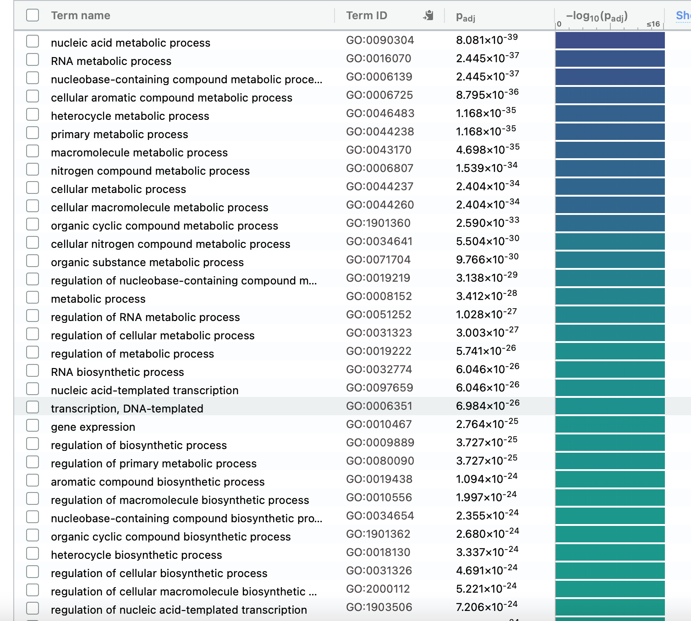


Reactome Annotation Results:
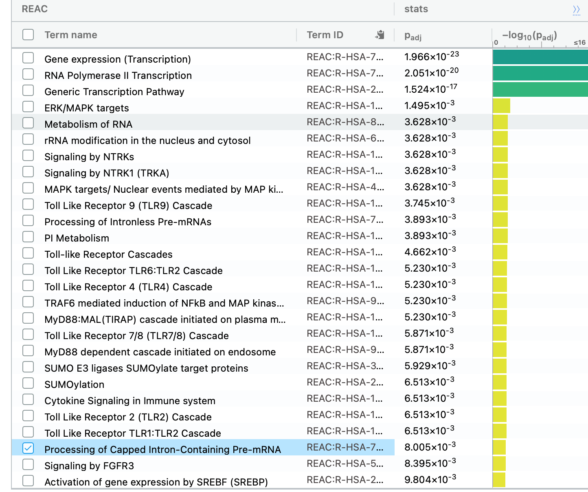


 Wiki Pathways Annotation Results:
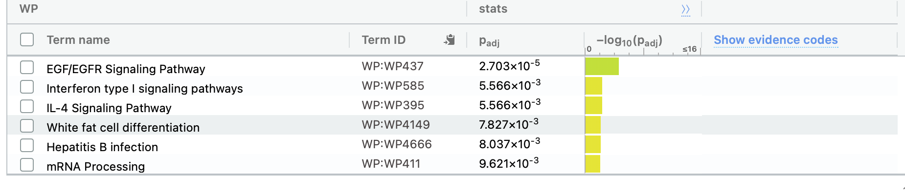


### Down Regulated Genes
 Go Annotation Results:
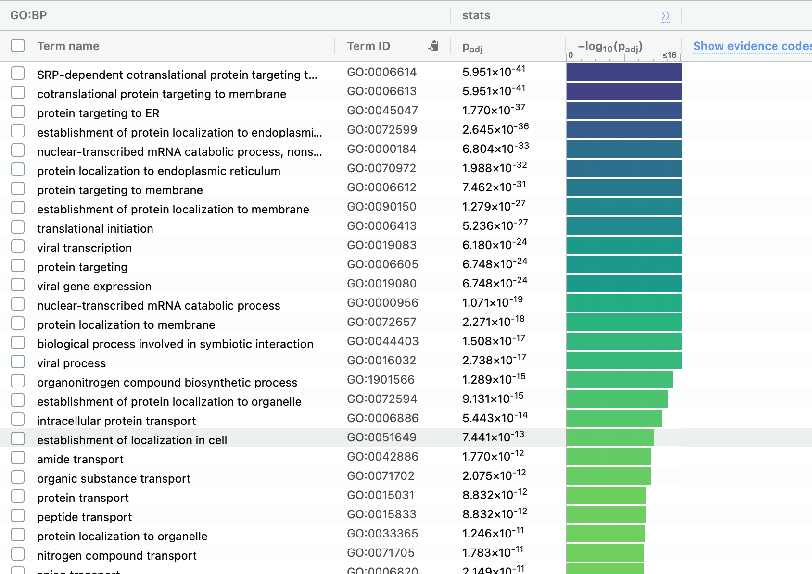


Reactome Annotation Results:
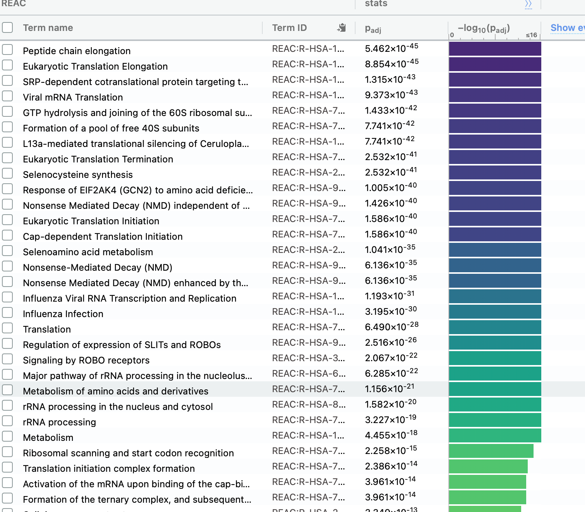


 Wiki Pathways Annotation Results:
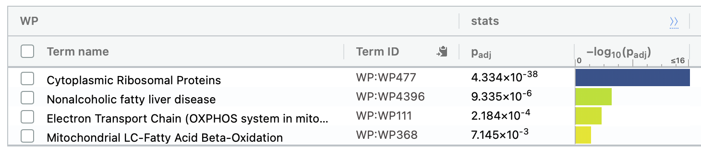


### Genes List:
 Go Annotation Results:
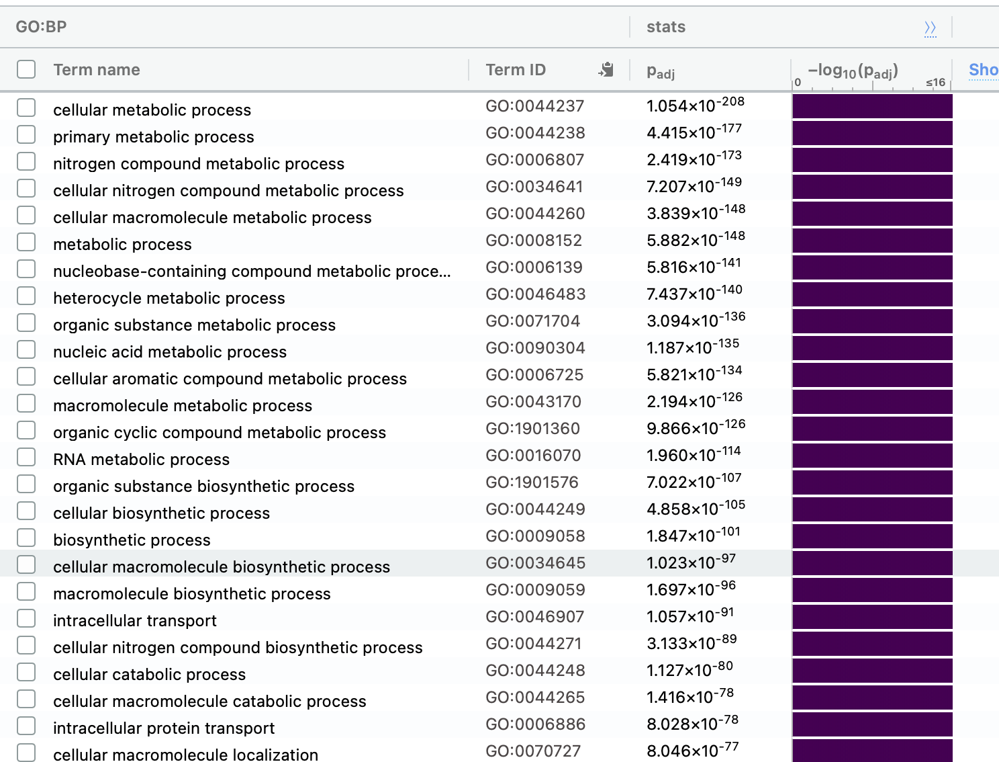


Reactome Annotation Results:
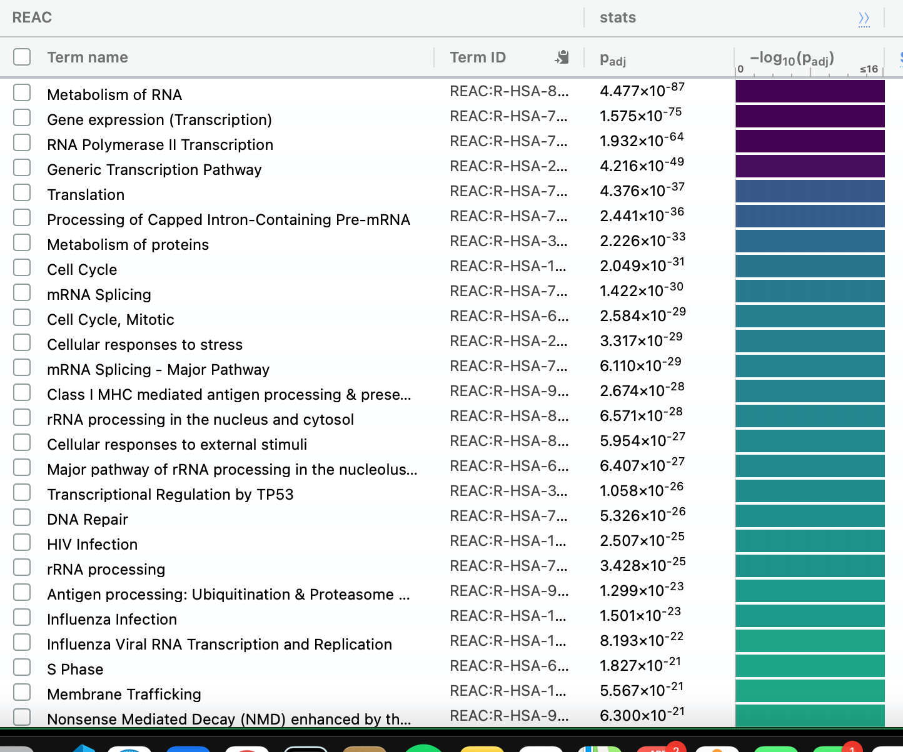


 Wiki Pathways Annotation Results:
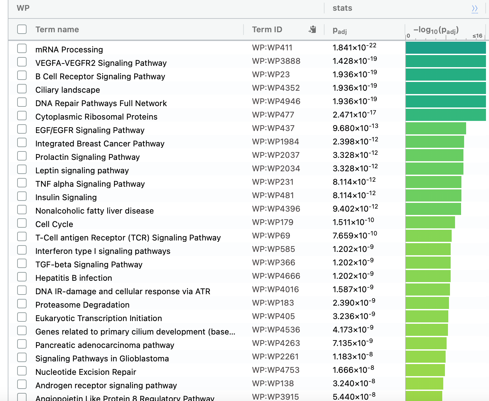

## Q&A

- Which method did you choose and why?

I chose to use G: profiler to work with thresholded lists

- What annotation data did you use and why? What version of the annotation are you using?

 GO:BP – annotations: BioMart classes: releases/2020-12-08
 
REAC – annotations: BioMart
classes: 2020-12-15
 
WP – 20201210

- How many genesets were returned with what thresholds?

The threshold balue is 0.01 with a max term size of 10000.  

Upregulted genes:

Go results: 99 genesets.

Reactome results: 27genesets 

Wikipathways results: 6 genesets 

Downregulted genes:

Go results: 143 genesets 

Reactome results: 50 genesets 

Wikipathways results: 4 genesets 


Go results: 1209 genesets

Reactome results: 529  genesets 

Wikipathways results: 154 genesets 

- Run the analysis using the up-regulated set of genes, and the down-regulated set of genes separately. How do these results compare to using the whole list (i.e all differentially expressed genes together vs. the up-regulated and down regulated differentially expressed genes separately)?

The results of all three analysis can be seen below

Up regulated Enrichment graph:
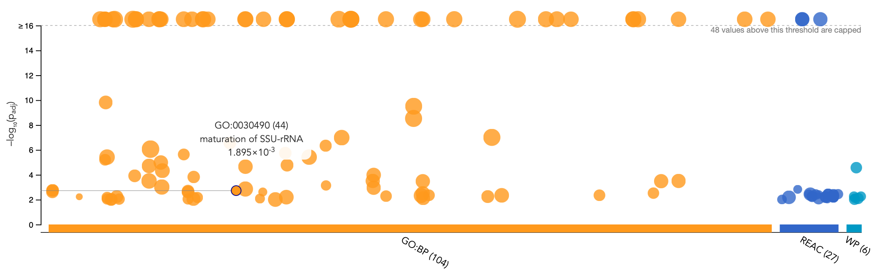


Downregulated list Enrichment graph:
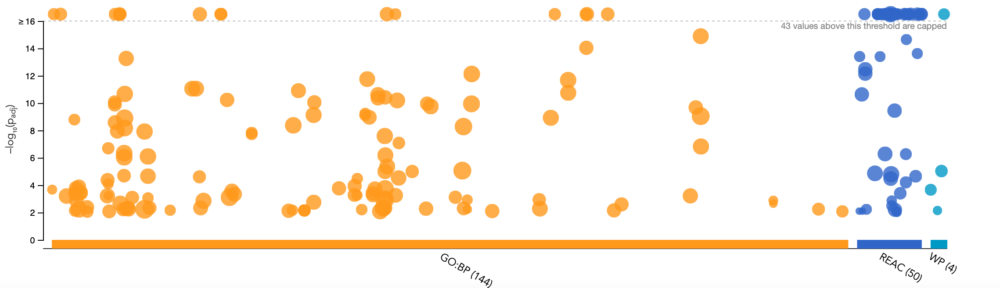


 Rank list Enrichment graph:
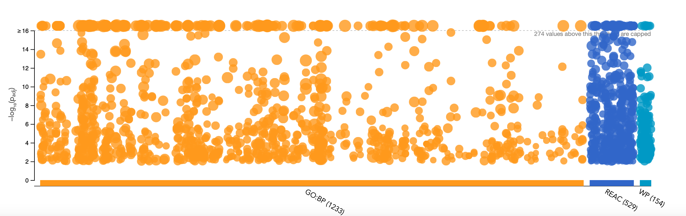


# References

## DataSet Paper
Weisel, N. M., Weisel, F. J., Farber, D. L., Borghesi, L. A., Shen, Y., Ma, W., Luning Prak, E. T., & Shlomchik, M. J. (2020). Comprehensive analyses of B-cell compartments across the human body reveal novel subsets and a gut-resident memory phenotype. Blood, 136(24), 2774–2785. https://doi.org/10.1182/blood.2019002782

## Packages

Yihui Xie (2014) knitr: A Comprehensive Tool for Reproducible Research in R. In
  Victoria Stodden, Friedrich Leisch and Roger D. Peng, editors, Implementing
  Reproducible Computational Research. Chapman and Hall/CRC. ISBN 978-1466561595
citation("ComplexHeatmap")

 Gu, Z. (2014) circlize implements and enhances circular visualization in R.
  Bioinformatics.


Ritchie, M.E., Phipson, B., Wu, D., Hu, Y., Law, C.W., Shi, W., and Smyth, G.K.
  (2015). limma powers differential expression analyses for RNA-sequencing and
  microarray studies. Nucleic Acids Research 43(7), e47.

strating high-throughput genomic analysis with Bioconductor. W. Huber,
  V.J. Carey, R. Gentleman, ..., M. Morgan Nature Methods, 2015:12, 115.

Hadley Wickham (2020). tidyr: Tidy Messy Data. R package version 1.1.2.
  https://CRAN.R-project.org/package=tidyr

Hadley Wickham, Romain François, Lionel Henry and Kirill Müller (2020). dplyr:
  A Grammar of Data Manipulation. R package version 1.0.2.
  https://CRAN.R-project.org/package=dplyr

Robinson MD, McCarthy DJ and Smyth GK (2010). edgeR: a Bioconductor package for
  differential expression analysis of digital gene expression data.
  Bioinformatics 26, 139-140

  Hao Zhu (2019). kableExtra: Construct Complex Table with 'kable' and Pipe
  Syntax. http://haozhu233.github.io/kableExtra/,
  https://github.com/haozhu233/kableExtra.

