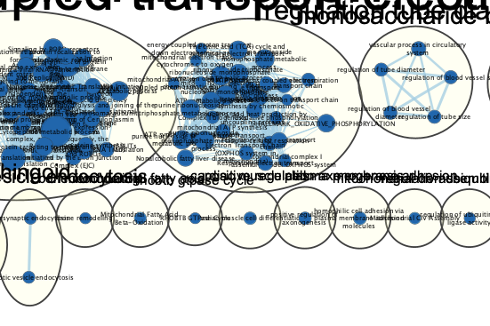

# Setup
Install and load required libraries
```{r echo=TRUE, message=FALSE}
if (!requireNamespace("BiocManager", quietly = TRUE)) install.packages("BiocManager")
if (!requireNamespace("GEOmetadb", quietly = TRUE))  BiocManager::install("GEOmetadb")
if (!requireNamespace("edgeR", quietly = TRUE))     BiocManager::install("edgeR")
if (!requireNamespace("biomaRt", quietly = TRUE))  BiocManager::install("biomaRt")
if (!requireNamespace("tidyverse", quietly = TRUE)) install.packages("tidyverse")     
if (!requireNamespace("gdtools", quietly = TRUE))    install.packages("gdtools")   
if (!requireNamespace("kableExtra", quietly = TRUE))  install.packages("kableExtra")   
if (!requireNamespace("data.table", quietly = TRUE))  install.packages("data.table")   
tryCatch(expr = { library("RCurl")}, 
         error = function(e) {  install.packages("RCurl")}, 
         finally = library("RCurl"))
library(knitr)
library(GEOmetadb)
library(edgeR)
library(biomaRt) 
library(dplyr)
library(kableExtra)
library(data.table)
```

# Introduction:
The dataset I have chosen to work for the assignment is titled Comprehensive analyses of B cell compartments across the human body reveal novel subsets and a gut resident memory phenotype. It can be found at https://www.ncbi.nlm.nih.gov/geo/query/acc.cgi?acc=GSE154583. This dataset  analyizes  B lineage cells in various tissues of multiple healthy organ donors which reveal tissue-specific differences and lack of correspondence between blood and tissues. New, functionally distinct memory B cell subsets were discovered, including one subset specific to the gut that has unique surface markers and a unique gene expression signature.
 	
## Overall design:	
RNA profiling of memory B cell subsets defined by CD45RB and CD69 expression in spleen. There were 4 biological replicates. I will be analysing the samples to find differences between naive B cell and MBC (memory B cell) across the 4 donors. 

The table below depicts the data set. The sample names legend is as follows:
D = donor
A/B/C/D = the donor name
N = Naive cell type
M = MBC
[1-9] = sample number for that cell type from that donor
Example: D.D.N.1 is the first sample from donor d of naive b cell type.
```{r}

normalized_count_data <- read.table(file=file.path(getwd(),"data", "ncmatrix.txt"),
                                    header = TRUE,sep = " ",
                                    stringsAsFactors = FALSE,
                                    check.names=FALSE)
kable(normalized_count_data[1:8,1:8], type="html")

```
# Thresholded List Analysis:

In Assignment 2, we created thresholded lists for analysis. The code belows uses the edgeR protocol to make the differentials gene expression lists. We used the Quasi Likelihood method to fir the model. 
```{r}
library("edgeR")
mc <- read.table(file=file.path(getwd(),"data","counts.txt"),
                                    header = TRUE,sep = " ",
                                    stringsAsFactors = FALSE,
                                    check.names=FALSE)
cpms = cpm(mc[, 1:27])
rownames(cpms) <- mc[,1]
# get rid of low counts
keep = rowSums(cpms >1) >=13  # following the edgeR protocol

counts_filtered = mc[keep,]
filtered_data_matrix <- as.matrix(counts_filtered[,1:27])
#set up the list
dgeList = DGEList(counts=filtered_data_matrix, group=samples$cell_type)

#uncomment the below line to view our dgeList
#dgeList
#Estimate dispersion in our donor model design
dgeList <- estimateDisp(dgeList, model_design_d1)

#fit the model according to Quasi likelihood method
fit <- glmQLFit(dgeList, model_design_d1)
library(kableExtra)
kable(model_design_d1[1:10,1:5], type="html") %>% row_spec(0, angle=45)
```
We write the table to lists in order construct a rank file. This will be use in our NonThresholded genelist enrichment analysis. The rank file lists ranks in decreeasing order.

```{r}
qlf.naive_vs_mbc <- glmQLFTest(fit, coef='samples$cell_typeN')
qlf_output_hits <- topTags(qlf.naive_vs_mbc,sort.by = "PValue",
                           n = nrow(normalized_count_data))
qlf_output_hits_withgn = as.data.frame(qlf_output_hits)
qlf_output_hits_withgn <- data.frame(names = row.names(qlf_output_hits_withgn), qlf_output_hits_withgn)
rownames(qlf_output_hits_withgn ) <- c()
qlf_output_hits_withgn <-qlf_output_hits_withgn[order(qlf_output_hits_withgn$PValue),]
# add rank column
qlf_output_hits_withgn[,"rank"] <- -log(qlf_output_hits_withgn$PValue, base = 10) * sign(qlf_output_hits_withgn$logFC)
qlf_output_hits_withgn <- qlf_output_hits_withgn[order(qlf_output_hits_withgn$rank, decreasing = TRUE),]

upregulated_genes <- rownames(qlf_output_hits_withgn)[   
  which(qlf_output_hits_withgn$PValue < 0.05      
        & qlf_output_hits_withgn$logFC > 0)] 

downregulated_genes <- rownames(qlf_output_hits_withgn)[  
  which(qlf_output_hits_withgn$PValue < 0.05             
        & qlf_output_hits_withgn$logFC < 0)]
write.table(x=upregulated_genes,          
            file=file.path("./data/","upregulated_genes.txt"),sep ="\t",
            row.names = FALSE,col.names = FALSE,quote = FALSE)
write.table(x=downregulated_genes,          
            file=file.path("./data/","downregulated_genes.txt"),sep ="\t",
            row.names = FALSE,col.names = FALSE,quote = FALSE)


# Need to clean this for gsea to accept the rank file

qlf_output_hits_withgn_Filtered <- qlf_output_hits_withgn[!(!is.na(rownames(qlf_output_hits_withgn)) & rownames(qlf_output_hits_withgn)==""), ] 
write.table(x=data.frame(genename= qlf_output_hits_withgn_Filtered$names, F_stat = qlf_output_hits_withgn_Filtered$rank),   
            file=file.path("./data","ranked_genelist_filtered.rnk"),sep ="\t",
            row.names = FALSE,col.names = TRUE,quote = FALSE)
qlf_output_hits_withgn_Filtered[1:5, 1:7]
```

# Non-thresholded Gene set Enrichment Analysis
I downloaded the Bader lab genesets to use at the dataset in my preranked analysis on GSEA. 
```{r}
gmt_url <- "http://download.baderlab.org/EM_Genesets/current_release/Human/symbol/"
filenames <- getURL(gmt_url)
tc <- textConnection(filenames)
contents <- readLines(tc)
close(tc)
rx <- gregexpr("(?<=<a href=\")(.*.GOBP_AllPathways_no_GO_iea.*.)(.gmt)(?=\">)", contents, perl = TRUE)
gmt_file <- unlist(regmatches(contents, rx))
download.file(paste(gmt_url, gmt_file, sep = ""), "gmt_file.gmt")


```

- What method did you use? What genesets did you use? Make sure to specify versions and cite your methods.

I used [GSEA](https://www.gsea-msigdb.org/gsea/index.jsp) v4.1.0 desktop application to conduct my analysis by running the GSEA Preranked list method.  For the gene-set, I used the most recent release of Baderlabs Geneset (http://download.baderlab.org/EM_Genesets/current_release/Human/symbol/)

The data set I used is:  "Human_GOBP_AllPathways_no_GO_iea_March_01_2021_symbol.gmt".  
This is saved as gmt_file within my data folder.
- Summarize your enrichment results.
The ranked_genelist_filtered.rnk filw we created at the end of assignment 2 was used for enrichment. 

Parameters: permutations: 1000 enrichment statistic: weighted max size: 500, min size: 15, collapse.

More detailed results can be seen in the figures below:

Complete GSEA analysis summary:


Up regulated genes summary:


The top geneset identified for upregulated list  was:

ADIPOGENESIS%WIKIPATHWAYS_20210210%WP236%HOMO SAPIENS

Enrichment Score (ES)	0.5800657

Normalized Enrichment Score (NES)	1.76886

Nominal p-value	0.0

FDR q-value	1.0

FWER p-Value	0.896


Down regulated genes summary:

The top annotation identified for down regulated list  was: 
GeneSet	PEPTIDE CHAIN ELONGATION%REACTOME%R-HSA-156902.2

Enrichment Score (ES)	-0.7705645
Normalized Enrichment Score (NES)	-2.8659337
Nominal p-value	0.0
FDR q-value	0.0
FWER p-Value	0.0

# CYTOSCAPE

## Using Enrichment Map
I used  the Enrichment Map application within Cytoscape to construct an intial network for the data. [EnrichmentMap](http://apps.cytoscape.org/apps/enrichmentmap) 

The figure below depicts the initial network:


Number of nodes: 100, Number of edges: 1291

Thresholds:

- P-value: 1.0 
- FDR Q-value: 0.05 
- Edge similarity score cutoff: 0.375  

The similarity score is defined by the Jaccard coeffecient.

## Using AutoAnnotate

I used AutoAnnotate Cytoscape application which is part of the [EnrichmentMap Pipeline Collection](http://apps.cytoscape.org/apps/enrichmentmappipelinecollection) I installed from Cytoscape.

The annotations are added to the entire network as shown in the figure below:




Match any (OR) 
Node: NES [-2.501, -1.565]
Node: NES [-1.205, 0.999]

This filter selects 79 nodes from 100. the figure below shoes the filtered network. Most of the change is near the top left cluster. 


For each cluster, make a summarised label using the collapse all feature in AutoAnnotate. This figure below shows a much more clear and condensed version of the network. 


# References

## DataSet Paper
Weisel, N. M., Weisel, F. J., Farber, D. L., Borghesi, L. A., Shen, Y., Ma, W., Luning Prak, E. T., & Shlomchik, M. J. (2020). Comprehensive analyses of B-cell compartments across the human body reveal novel subsets and a gut-resident memory phenotype. Blood, 136(24), 2774–2785. https://doi.org/10.1182/blood.2019002782

## Packages

Yihui Xie (2014) knitr: A Comprehensive Tool for Reproducible Research in R. In
  Victoria Stodden, Friedrich Leisch and Roger D. Peng, editors, Implementing
  Reproducible Computational Research. Chapman and Hall/CRC. ISBN 978-1466561595
citation("ComplexHeatmap")

 Gu, Z. (2014) circlize implements and enhances circular visualization in R.
  Bioinformatics.


Ritchie, M.E., Phipson, B., Wu, D., Hu, Y., Law, C.W., Shi, W., and Smyth, G.K.
  (2015). limma powers differential expression analyses for RNA-sequencing and
  microarray studies. Nucleic Acids Research 43(7), e47.

strating high-throughput genomic analysis with Bioconductor. W. Huber,
  V.J. Carey, R. Gentleman, ..., M. Morgan Nature Methods, 2015:12, 115.

Hadley Wickham (2020). tidyr: Tidy Messy Data. R package version 1.1.2.
  https://CRAN.R-project.org/package=tidyr

Hadley Wickham, Romain François, Lionel Henry and Kirill Müller (2020). dplyr:
  A Grammar of Data Manipulation. R package version 1.0.2.
  https://CRAN.R-project.org/package=dplyr

Robinson MD, McCarthy DJ and Smyth GK (2010). edgeR: a Bioconductor package for
  differential expression analysis of digital gene expression data.
  Bioinformatics 26, 139-140

  Hao Zhu (2019). kableExtra: Construct Complex Table with 'kable' and Pipe
  Syntax. http://haozhu233.github.io/kableExtra/,
  https://github.com/haozhu233/kableExtra.
  
Duncan Temple Lang (2020). RCurl: General Network (HTTP/FTP/...) Client
  Interface for R. R package version 1.98-1.2.
  https://CRAN.R-project.org/package=RCurl


